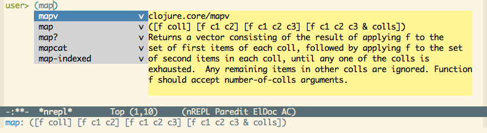
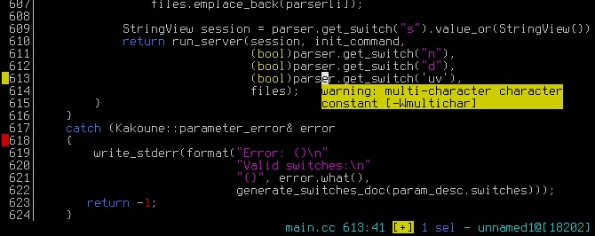
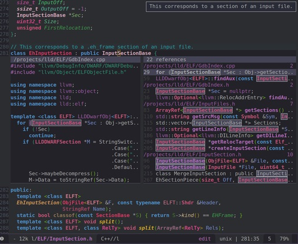
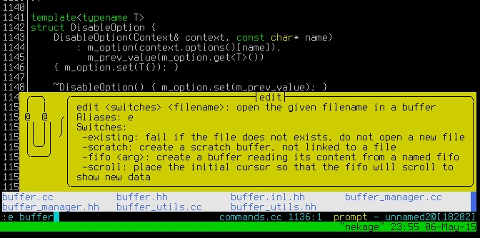
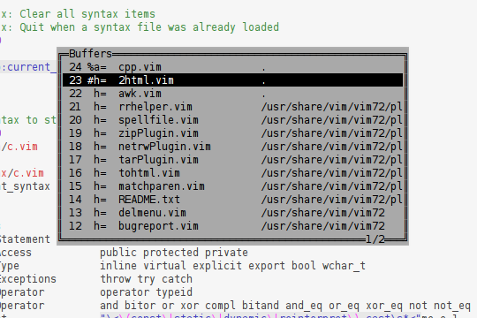
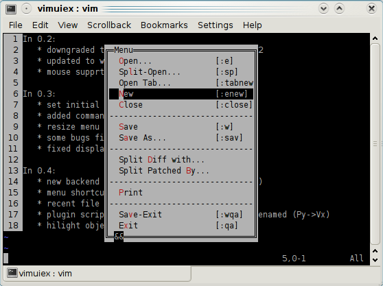
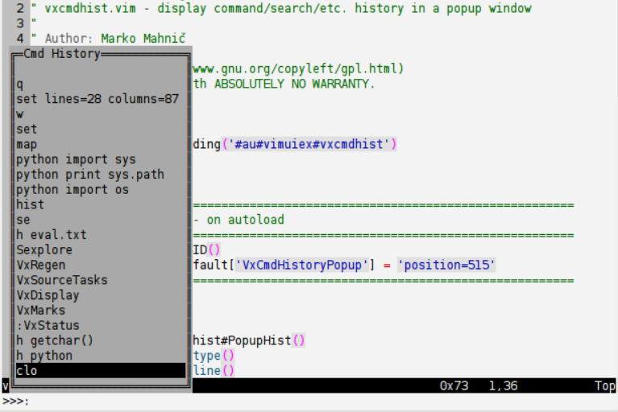
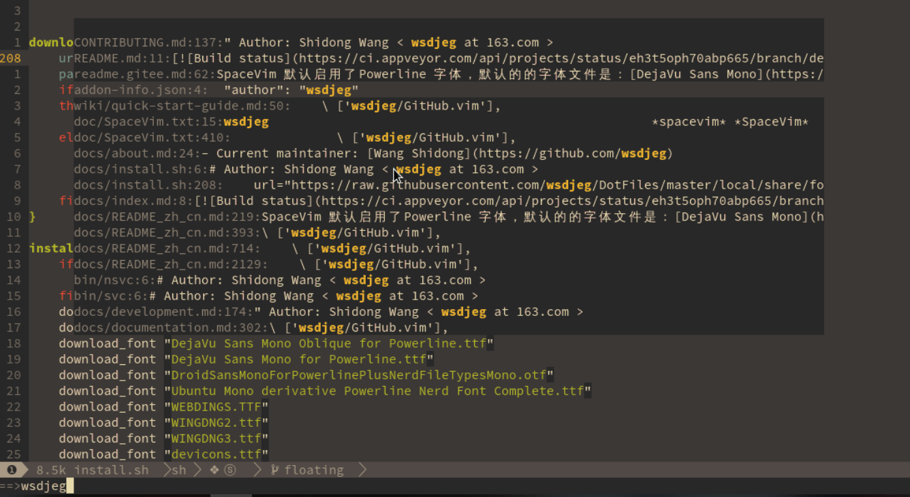

# Popup Window API Proposal

## Problem

Vim has already got some builtin popup-widgets for certain usage, like completion menu or balloon. But users and plugin authors are still asking for more:

- 3379: [Support Floating Window](https://github.com/vim/vim/issues/3379)
- 2948: [balloon_show doesn't display the balloon](https://github.com/vim/vim/issues/2948)
- 2352: [Call to balloon_show() doesn't show the balloon in the terminal](https://github.com/vim/vim/issues/2352)
- 3811: [Feature Request: Trigger balloon via keyboard at cursor position](https://github.com/vim/vim/issues/3811)

In Vim conf 2018, Bram claimed that he has [plan for this](https://vimconf.org/2018/slides/Vim_From-hjkl-to-a-platform-for-plugins.pdf) already: 

> Popup Windows:
> 
> Use for a notification:
> - Asynchronously show window with text “build done”.
> - Remove after a few seconds.
> 
> Use for picking an item:
> - Show window where each line is an item
> - Let user pick an item
> - A bit like confirm() but much nicer

Summary, there are two types of popup window: interactive and non-interactive. 

For non-interactive popup windows, people want to use them to:

- Display the documentation for a function:

- Display linting errors or warnings:

- Preview a portion of file (can be used to preview grep results in quickfix):

- Display funny help for newbies:

For interactive popup windows, people want to use them to:

- pick an item:

- display a nice popup menu:

- cmd line completion:

- use fuzzy finder in a popup window:

There are too many popup-related widgets for too many different usage, implement one by one is nearly impossible. 

Introducing a neovim's [floating window](https://github.com/neovim/neovim/pull/6619) will take too much time (it is working in progress for almost 2-years and still not merge to master).

Is this possible to unify all their needs and simplily api design ? Can we implement the popup window in a simple and adaptive way ?  

## Goals

- Unify and simplify the popup window apis.
- Adaptive and can be use to implement various popup windows and dialogs.
- Easy to implement.

